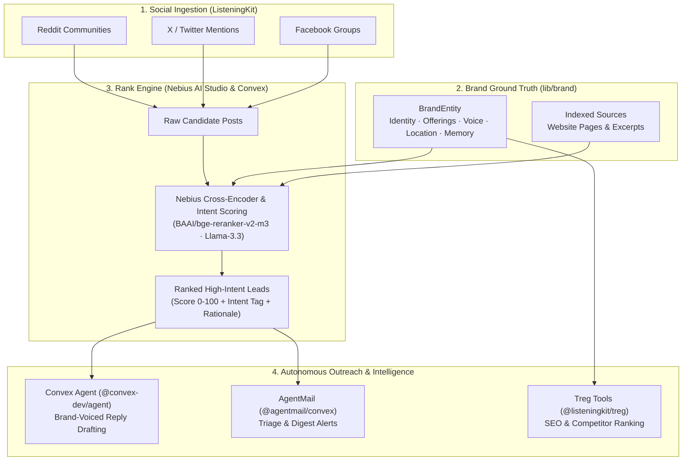

<p align="center">
  
</p>

# Rank by ListeningKit

<p align="center">
  <a href="https://nebius.com"></a>
  <a href="https://rank.listeningkit.com"></a>
  <a href="LICENSE"></a>
  <a href="https://modelcontextprotocol.io"></a>
  <a href="https://convex.dev"></a>
</p>

> **The Real-Time Social Lead Ranking, Intent Scoring, and Brand Outreach Engine for ListeningKit.**  
> Powered by **Nebius AI Studio** high-throughput GPU inference, **Convex Cloud** reactive persistence, and **TypeSafe AI (Jev / System One)** calibrated intent evaluation. Ingest social streams across Reddit, X (Twitter), and Facebook, evaluate candidate posts against your business's grounded **Brand Profile**, and autonomously route high-intent leads to AI agents.

> **Live Deployment:** [https://rank.listeningkit.com](https://rank.listeningkit.com)  
> **Brand Engine Docs:** [docs/brand/](docs/brand/)  
> **Architecture & Diagrams:** [docs/diagrams/](docs/diagrams/)  
> **API & MCP Reference:** [docs/api-and-mcp.md](docs/api-and-mcp.md)  
> **Features Guide:** [docs/features.md](docs/features.md)  
> **Self-Hosting Guide:** [docs/self-hosting.md](docs/self-hosting.md)  

---

## What is Rank by ListeningKit?

ListeningKit monitors social media platforms (Reddit communities, X/Twitter feeds, Facebook Groups) for whole-word keyword occurrences to identify potential sales opportunities and brand mentions. However, raw keyword matching creates massive volumes of noise: casual chatter, sarcastic jokes, unrelated product complaints, and geographic mismatches. Over 90% of raw keyword alerts are not actionable leads.

**Rank by ListeningKit** is the intelligence layer that sits between raw social ingestion and autonomous action. It evaluates every incoming candidate post against a structured **Brand Profile** (`BrandEntity`), runs precision intent scoring via **Nebius AI Studio GPU cross-encoders**, and classifies high-intent sales opportunities with verifiable confidence scores in milliseconds.



---

## Key Capabilities

- **Cross-Encoder Social Lead Reranking:** Precision scoring over incoming social posts via Nebius-hosted models (`BAAI/bge-reranker-v2-m3`). Scores direct contextual cross-attention between brand offerings and social queries.
- **Brand Ground Truth System (`lib/brand/`):** Strict, type-safe business profile containing offerings, target persona, geographic boundaries (`location`), voice dials, and operational memory boundaries.
- **Calibrated Intent Gating:** Evaluates buying intent (Urgent Need, Product Evaluation, Casual Chat, Competitor Complaint) with confidence distributions via TypeSafe System One (Jev).
- **Competitor & Keyword Intelligence (`@listeningkit/treg`):** Deep keyword ranking, domain competitor discovery, and Google search dorking strategies using SpyFu, SE Ranking, and Brave Search.
- **Autonomous Outreach Pipeline (`@convex-dev/agent`):** Automatically drafts platform-native, brand-aligned responses grounded in indexed website pages (`BrandPage`) with verified citations.
- **Reactive Alert Dispatch (`@agentmail/convex`):** Sends prioritized email notifications and summaries when high-score leads cross intent thresholds.
- **Sub-Millisecond Hot-Path Caching:** In-memory LRU caching eliminates redundant model calls for duplicate social mentions and trending search queries.

---

## Quickstart

### 1. Environment Setup

Copy `.env.example` to `.env.local` and provide your credentials:

```bash
cp .env.example .env.local
```

```env
NEBIUS_API_KEY=your_nebius_api_key_here
NEBIUS_BASE_URL=https://api.studio.nebius.ai/v1
DEFAULT_RANK_MODEL=BAAI/bge-reranker-v2-m3
CONVEX_URL=https://your-convex-deployment.convex.cloud
PORT=3000
```

### 2. Basic Social Lead Ranking

```typescript
import { RankClient } from "./src";
import { brandClient } from "./lib/brand";

const ranker = new RankClient({
  apiKey: process.env.NEBIUS_API_KEY,
});

// 1. Fetch grounded brand profile (offerings, location, voice rules)
const brand = await brandClient.getBrand();

// 2. Rank incoming social candidates against brand offerings
const results = await ranker.rerank({
  query: `Looking for commercial heating repairs and boiler maintenance: ${brand.offerings.map((o) => o.title).join(", ")}`,
  candidates: [
    {
      id: "post_reddit_01",
      text: "Boiler stopped working at our commercial kitchen in Galway this morning. Need urgent commercial repair technician.",
    },
    {
      id: "post_x_02",
      text: "Just moved to Dublin, anyone know good coffee roasters nearby?",
    },
    {
      id: "post_fb_03",
      text: "Annual boiler safety inspection due next month for our apartment block in County Galway. Any recommendations?",
    },
  ],
  topK: 2,
});

console.log("Ranked Leads:", results);
```

---

## Subsystem Architecture & Documentation

The codebase is organized into normalized bounded contexts following the `lib/{library}/{domainname}/helpers/` convention:

- **[System Architecture](docs/architecture.md):** Detailed technical design, request lifecycles, and component interactions.
- **[Brand System Guide](docs/brand/README.md):** Brand profile structure, deterministic seed data, voice compiler, and website indexing.
- **[Brand Voice Specification](docs/brand/voice.md):** Tone dials, perspective rules, and forbidden phrases.
- **[Social Channel Strategies](docs/brand/channels.md):** Reddit, X (Twitter), Facebook, and LinkedIn outreach guidelines.
- **[Agent Context & Synthesis](docs/brand/agent-context.md):** Context building, citation ground truth, and prompt injection defenses.
- **[Website Indexing & Scraping](docs/brand/website-indexing.md):** Firecrawl ingestion pipeline, markdown normalization, and excerpt chunking.
- **[Architecture Diagrams](docs/diagrams/):** Standalone Mermaid `.mmd` diagrams covering system topology, lead ranking pipeline, brand feedback loops, and data models.
- **[Features Reference](docs/features.md):** Deep dive into cross-encoder reranking, multi-signal fusion, confidence gating, and token optimization.
- **[API & MCP Reference](docs/api-and-mcp.md):** Complete specifications for `/v1/rerank`, `/v1/evaluate`, and the Model Context Protocol (MCP) server for Claude Code and Cursor.
- **[Self-Hosting Guide](docs/self-hosting.md):** Environment setup, Nebius AI Studio configuration, local development, and Convex deployment.
- **[Naming & Architecture Conventions](docs/naming-conventions.md):** Specification for module boundaries, barrel re-exports, and domain taxonomy.
- **[Contributing Guidelines](docs/contributing.md):** Code style, commit conventions, and pull request workflows.

---

## License

MIT (c) 2026 [Rank Contributors / ListeningKit](LICENSE)
