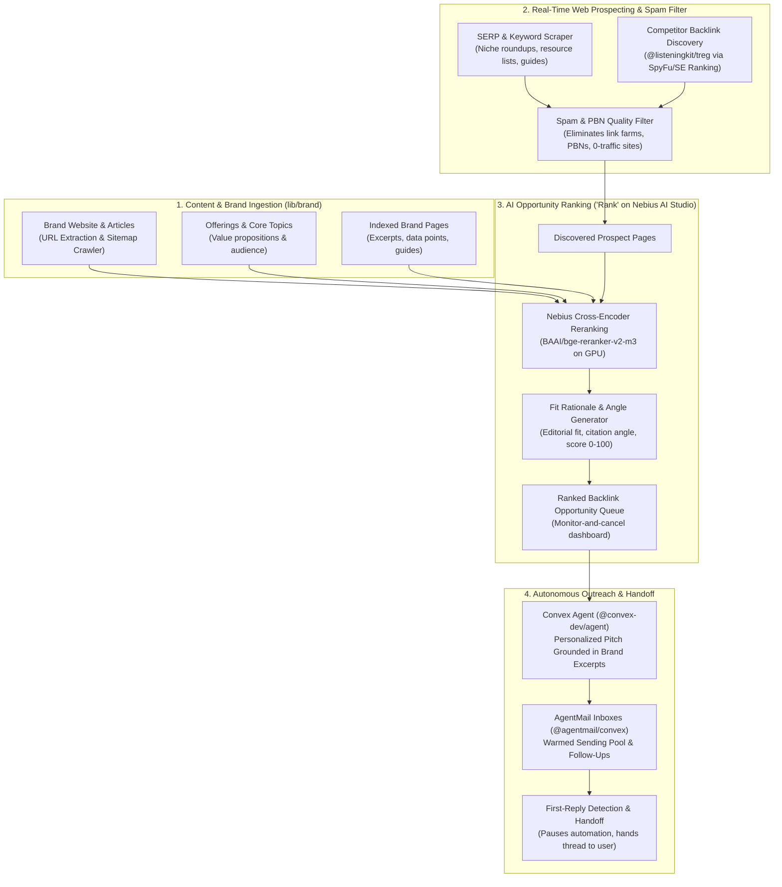

<p align="center">
  
</p>

# Rank by ListeningKit

<p align="center">
  <a href="https://nebius.com"></a>
  <a href="https://rank.listeningkit.com"></a>
  <a href="LICENSE"></a>
  <a href="https://modelcontextprotocol.io"></a>
  <a href="https://convex.dev"></a>
</p>

> **The Autonomous AI Link-Building, Backlink Prospect Ranking & Editorial Outreach Engine for ListeningKit.**  
> Powered by **Nebius AI Studio** high-throughput GPU inference, **Convex Cloud** reactive persistence, and **TypeSafe AI (Jev / System One)** calibrated decision evaluation. Continuously discover high-authority websites and articles where your content belongs as a natural citation, rank opportunities with cross-encoders, and autonomously run personalized outreach through the first reply.

> **Live Deployment:** [https://rank.listeningkit.com](https://rank.listeningkit.com)  
> **Brand Engine Docs:** [docs/brand/](docs/brand/)  
> **Architecture & Diagrams:** [docs/diagrams/](docs/diagrams/)  
> **API & MCP Reference:** [docs/api-and-mcp.md](docs/api-and-mcp.md)  
> **Features Guide:** [docs/features.md](docs/features.md)  
> **Self-Hosting Guide:** [docs/self-hosting.md](docs/self-hosting.md)  

---

## What is Rank by ListeningKit?

Traditional link building is broken. Agencies charge $1,000 to $5,000 per month with zero transparency, while DIY prospecting across disjointed tools (Ahrefs, Hunter, Instantly) demands 10 to 15 hours every week of manual list building, contact scraping, and generic cold emailing. Most outreach databases sell contacts scraped months ago that bounce or end up in spam.

**Rank by ListeningKit** replaces the entire manual workflow with an autonomous AI agent. It connects to your website and published articles, scans the live web for places where your content serves as a high-value editorial citation or resource recommendation, filters out spam and link networks, and uses **Nebius-hosted GPU cross-encoders** to **rank every prospect** by editorial relevance and SEO impact.

High-ranking opportunities are pitched autonomously via **`@convex-dev/agent`** and **`@agentmail/convex`** from dedicated, warmed sending inboxes. The moment an editor or site owner responds, automation pauses and the conversation is handed off to you.



---

## Why It Is Called "Rank"

In link building, raw search queries and competitor backlink lists surface thousands of candidate URLs. The core bottleneck is evaluating:
1. **Does this article genuinely need our citation or resource?**
2. **What is the exact editorial angle that will earn an author's acceptance?**
3. **Is the target site a legitimate, high-traffic publication rather than a private blog network (PBN)?**

**Rank** solves this by evaluating candidate web pages through **Nebius AI Studio GPU cross-encoders** (`BAAI/bge-reranker-v2-m3`) and open LLMs. It computes true cross-attention logits between the target page's text and your brand's content, ranking opportunities from 0 to 100 with plain-language fit rationales.

---

## Key Capabilities

- **Cross-Encoder Prospect Reranking:** Precision scoring over discovered web articles and resource pages via Nebius-hosted models (`BAAI/bge-reranker-v2-m3`). Evaluates contextual relevance between the target publication and your brand's assets.
- **Brand Content Grounding (`lib/brand/`):** Indexes your website pages, published articles, original research, and offerings (`BrandPage`). Learns what each piece covers, who it helps, and why another publication would cite it.
- **Real-Time Live Scraping (Never Stale Databases):** Scrapes prospect pages and verifies author contacts live on every run, ensuring traffic, domain authority, and editorial details reflect the site today.
- **PBN & Link Farm Quality Filter:** Automatically eliminates private blog networks (PBNs), generic directories, and zero-traffic link farms before opportunities enter your queue.
- **Plain-Language Fit Rationales & Angles:** Every candidate includes a concise explanation of why it was selected and a specific editorial pitch angle (e.g. data source citation, missing alternative in roundup, guest perspective).
- **Competitor Backlink Intelligence (`@listeningkit/treg`):** Detects competitor backlink placements and tracks keyword search visibility via SpyFu, SE Ranking, and Brave Search.
- **Autonomous Outreach Through First Reply (`@convex-dev/agent` & `@agentmail/convex`):** Drafts context-grounded pitch emails and sends them from a warmed sending pool. Automatically follows up until the prospect responds, then immediately hands off the thread to your personal mailbox.
- **Monitor-and-Cancel Opportunity Queue:** Full transparency with zero agency markup. Review target sites, fit rationales, and email drafts in your daily queue, and cancel any opportunity that is not a fit before it sends.
- **Model Context Protocol (MCP) Server:** Connect Claude Code, Cursor, or Codex directly to your live link-building pipeline to inspect backlink opportunities, verify queue status, and query reply metrics.

---

## Quickstart

### 1. Environment Setup

Copy `.env.example` to `.env.local` and provide your credentials:

```bash
cp .env.example .env.local
```

```env
NEBIUS_API_KEY=your_nebius_api_key_here
NEBIUS_BASE_URL=https://api.studio.nebius.ai/v1
DEFAULT_RANK_MODEL=BAAI/bge-reranker-v2-m3
CONVEX_URL=https://your-convex-deployment.convex.cloud
PORT=3000
```

### 2. Basic Backlink Prospect Ranking

```typescript
import { RankClient } from "./src";
import { brandClient } from "./lib/brand";

const ranker = new RankClient({
  apiKey: process.env.NEBIUS_API_KEY,
});

// 1. Fetch grounded brand content assets and indexed pages
const brand = await brandClient.getBrand();

// 2. Rank discovered web articles against a specific brand content asset
const results = await ranker.rerank({
  query: `Authoritative guide to distributed AI inference optimization and GPU latency reduction: ${brand.offerings.map((o) => o.title).join(", ")}`,
  candidates: [
    {
      id: "prospect_01",
      text: "Comprehensive engineering breakdown on scaling large language model inference clusters with cross-encoder routing.",
    },
    {
      id: "prospect_02",
      text: "Top 10 boutique coffee shops to visit in central London this weekend.",
    },
    {
      id: "prospect_03",
      text: "Curated industry resource list of open-source model optimization tools and latency benchmarking frameworks.",
    },
  ],
  topK: 2,
});

console.log("Ranked Opportunities:", results);
```

---

## Subsystem Architecture & Documentation

The codebase is organized into normalized bounded contexts following the `lib/{library}/{domainname}/helpers/` convention:

- **[System Architecture](docs/architecture.md):** Detailed technical design, discovery pipelines, and backlink ranking request lifecycles.
- **[Brand System Guide](docs/brand/README.md):** Brand profile structure, sitemap crawling, indexed citations (`BrandPage`), and content ground truth.
- **[Communication Profiles](docs/brand/channels.md):** Editorial pitch styles, resource suggestions, and contributor outreach guidelines.
- **[Agent Context & Synthesis](docs/brand/agent-context.md):** Convex agent prompt compilation and citation ground truth.
- **[Website Indexing & Scraping](docs/brand/website-indexing.md):** Firecrawl ingestion pipeline, markdown normalization, and excerpt chunking.
- **[Architecture Diagrams](docs/diagrams/):** Standalone Mermaid `.mmd` diagrams covering system topology, opportunity ranking pipeline, and data models.
- **[Features Reference](docs/features.md):** Deep dive into cross-encoder reranking, PBN filtering, fit angle generation, and first-reply handoffs.
- **[API & MCP Reference](docs/api-and-mcp.md):** Complete specifications for `/v1/rerank`, `/v1/evaluate`, and the Model Context Protocol (MCP) server for Claude Code and Cursor.
- **[Self-Hosting Guide](docs/self-hosting.md):** Environment setup, Nebius AI Studio configuration, local development, and Convex deployment.
- **[Naming & Architecture Conventions](docs/naming-conventions.md):** Specification for module boundaries, barrel re-exports, and domain taxonomy.
- **[Contributing Guidelines](docs/contributing.md):** Code style, commit conventions, and pull request workflows.

---

## License

MIT (c) 2026 [Rank Contributors / ListeningKit](LICENSE)
