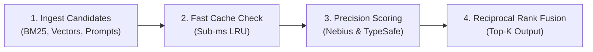

<p align="center">
  
</p>

# Rank by ListeningKit

<p align="center">
  <a href="https://nebius.com"></a>
  <a href="https://rank.listeningkit.com"></a>
  <a href="LICENSE"></a>
  <a href="https://modelcontextprotocol.io"></a>
  <a href="https://convex.dev"></a>
</p>

> **An ultra-low latency AI ranking, semantic reranking, and model decision routing engine.**  
> Built for **Nebius AI Studio** high-throughput GPU inference and **TypeSafe AI (Jev / System One)** calibrated decision evaluation on **Convex Cloud**. Elevate RAG retrieval accuracy, benchmark open-weights models, and route agent decisions with sub-millisecond hot-path caching.

> **Live Deployment:** [https://rank.listeningkit.com](https://rank.listeningkit.com)  
> **Architecture & Diagrams:** [docs/diagrams/](docs/diagrams/)  
> **API & MCP Reference:** [docs/api-and-mcp.md](docs/api-and-mcp.md)  
> **Features Guide:** [docs/features.md](docs/features.md)  
> **Self-Hosting Guide:** [docs/self-hosting.md](docs/self-hosting.md)  

---

## ⚡ What is Rank by ListeningKit?

In modern AI architectures—whether semantic search, RAG pipelines, social firehoses, or agentic routing—initial retrieval is only half the battle. Vector databases and keyword lookups surface plausible candidates, but they lack fine-grained nuance.

**Rank by ListeningKit** bridges high-speed retrieval and precision execution. By orchestrating **Nebius-hosted cross-encoders** (`bge-reranker-v2-m3`), **TypeSafe System One decision primitives**, and **Convex real-time telemetry**, Rank delivers calibrated, ranked candidate lists with verifiable confidence scores in milliseconds.



---

## 🧭 Documentation & Architecture

The documentation is modularized into domain-separated references:

- 🏛 **[System Architecture](docs/architecture.md):** Detailed technical design, request lifecycles, and component interactions.
- 📊 **[Architecture Diagrams](docs/diagrams/):** Standalone Mermaid `.mmd` diagrams covering system topology, the two-stage ranking pipeline, data model ERDs, and API authentication sequences.
- ⚡ **[Features Reference](docs/features.md):** Deep dive into cross-encoder reranking, multi-signal fusion, confidence gating, and token optimization.
- 📡 **[API & MCP Reference](docs/api-and-mcp.md):** Complete specifications for `/v1/rerank`, `/v1/evaluate`, and the Model Context Protocol (MCP) server for Claude/Cursor.
- 🛠 **[Self-Hosting Guide](docs/self-hosting.md):** Environment setup, Nebius AI Studio configuration, local development, and Convex deployment.
- 🤝 **[Contributing Guidelines](docs/contributing.md):** Code style, commit conventions, and pull request workflows.

---

## 🎯 Key Capabilities

- **Cross-Encoder Semantic Reranking:** Precision scoring over retrieved candidate passages, documents, or social posts via Nebius-hosted models (`BAAI/bge-reranker-v2-m3`).
- **Calibrated System One Evaluation:** Evaluates typed questions (Choice, Score, Noul) with confidence distributions via TypeSafe's Jev model.
- **Reciprocal Rank Fusion (RRF):** Blends BM25, dense embeddings, and cross-encoder logits into a unified rank list.
- **Sub-Millisecond Hot-Path Caching:** In-memory LRU caching eliminates redundant model calls for frequent queries.
- **Developer-First SDK & MCP:** Lightweight TypeScript/Node client and standard MCP server endpoints.

---

## 🚀 Quickstart

### 1. Environment Setup

Copy `.env.example` to `.env.local` and provide your credentials:

```bash
cp .env.example .env.local
```

```env
NEBIUS_API_KEY=your_nebius_api_key_here
NEBIUS_BASE_URL=https://api.studio.nebius.ai/v1
DEFAULT_RANK_MODEL=BAAI/bge-reranker-v2-m3
PORT=3000
```

### 2. Basic Usage

```typescript
import { RankClient } from "./src";

const ranker = new RankClient({
  apiKey: process.env.NEBIUS_API_KEY,
});

const results = await ranker.rank({
  query: "High performance inference on GPU clusters",
  candidates: [
    "Nebius provides specialized NVIDIA H100/H200 infrastructure with ultra-low latency.",
    "Baking sourdough bread requires precise flour-to-water ratios.",
    "Vector search algorithms like HNSW enable fast nearest neighbor searches.",
  ],
  topK: 2,
});

console.log(results);
```

---

## 📄 License

MIT © 2026 [Rank Contributors / ListeningKit](LICENSE)
