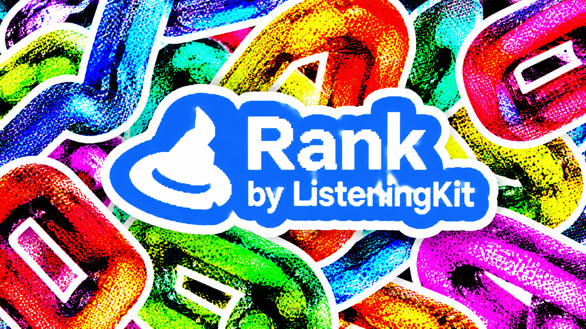
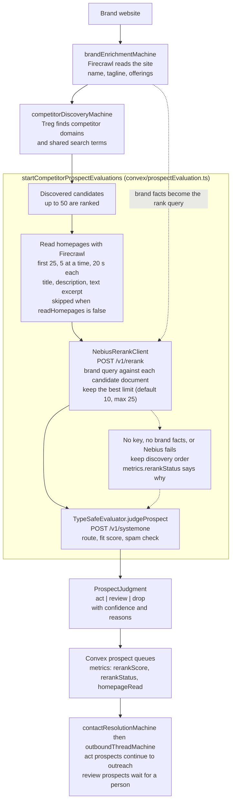

# Rank by ListeningKit

Rank is an AI-assisted link-building and backlink prospect ranking engine for ListeningKit. The product goal is to turn a brand's own content into grounded evidence, find publications and pages where that content is genuinely useful, explain the editorial fit, and eventually help an agent prepare a personalized outreach decision.

The repository is being built in verified stages. The current code implements the brand, discovery, evaluation, outbound state, provider boundaries, persistence, and machine foundations; it does not yet claim to run a production outreach service or remote model pipeline.

## The Core Idea

A useful link prospect is not simply a domain with a backlink. It is a page where a brand's research, product, or expertise can make a real contribution.

Rank is designed to answer four questions:

1. What does this brand know, offer, and want to be cited for?
2. Which pages and publications could genuinely benefit from that content?
3. Is the opportunity editorially relevant and trustworthy enough to pursue?
4. What action should the system take: `act`, `review`, or `drop`?

The long-term product loop is:

```text
brand grounding → prospect discovery → fit and safety judgment → ranked queue → agent-assisted guest-post outreach
```

The current implementation owns the first three steps and the persisted outbound state boundary. The outbound machine, mock provider adapters, domain/inbox pool, AgentMail queue wrapper, and Agent reasoning prompt are implemented; live Nebius model execution and production sending remain unconfigured.

## Current Implementation

| Area | Source | Current behavior |
|---|---|---|
| Brand grounding | `lib/brand/` | Stores identity, offerings, voice, sources, and deterministic prompt helpers |
| Source enrichment | `lib/firecrawl/crawl/` and `convex/enrichment.ts` | Maps and scrapes source pages through the Firecrawl boundary |
| Competitor discovery | `lib/xstate/competitor-discovery/` and `convex/competitorDiscovery.ts` | Calls Treg providers and normalizes candidate domains |
| Prospect judgment | `lib/nebius/rerank/`, `lib/typesafe/evaluator/` and `convex/prospectEvaluation.ts` | Reads candidate homepages, ranks candidates with Nebius, then `TypeSafeEvaluator` calls System One and persists `act`, `review`, or `drop` |
| Outbound conversations | `lib/xstate/outbound/`, `lib/xstate/contact-resolution/`, `convex/outbound.ts`, and `convex/email.ts` | Persists contact resolution, guest-post approvals, reply/deal state, follow-ups, domain/inbox pools, and AgentMail idempotency |
| Agent reasoning | `convex/agent.ts` and `lib/xstate/outbound/agent-prompt.ts` | Creates separate mock Agent reasoning sessions with brand/prospect/goal context |
| Workflow state | `lib/xstate/` | XState v6 machines with retry, cancellation, and versioned persistence |
| Verification | `mock/` and `scripts/verify-mock.mjs` | Exercises current mock routes and documentation-backed fixtures |

`NebiusRerankClient` calls the Nebius Token Factory rerank endpoint (`POST /v1/rerank`, default model `Qwen/Qwen3-Reranker-8B`) with retries, response validation and plain-language errors. `convex/prospectEvaluation.ts` constructs it when `NEBIUS_API_KEY` is set, so the rerank step is part of the run. It has been tested against the documented response shape with a fake network only and has not yet been exercised against the Token Factory API. The client never reports an unranked list as ranked: `rankCandidates` keeps discovery order and stores `skipped` or `failed` with a reason in `metrics.rerankStatus`. `baselineRank` is the separate local stand-in for tests.

## How a Run Works

A run reads the brand's site, finds competitor domains, reads each candidate's homepage, ranks the candidates against the brand with Nebius, and only then spends TypeSafe calls judging the best ones. Solid arrows are the normal path; dotted arrows are the fallback when ranking cannot run (the candidates keep discovery order and `metrics.rerankStatus` records why). The diagram lives in [`docs/diagrams/ranking-pipeline.mmd`](docs/diagrams/ranking-pipeline.mmd); the other diagrams are listed in [`docs/diagrams/`](docs/diagrams/).



## Machine Chain

The machine files are the behavioral source of truth. The generated inventory is checked by `scripts/check-machine-docs.mjs`.

| Machine | States | Responsibility |
|---|---|---|
| `brandEnrichmentMachine` | `idle → mapping → scraping → extracting → completed` | Build structured source facts |
| `competitorDiscoveryMachine` | `idle → discovering → normalizing → completed` | Find and normalize candidate domains |
| `prospectEvaluationMachine` | `idle → evaluating → completed` | Persist confidence-gated TypeSafe decisions |
| `contactResolutionMachine` | `checking_domain → checking_contact → deliverable` | Persist domain/contact deliverability and bounce recovery |
| `outboundThreadMachine` | `drafting → approval → delivery → reply → deal/follow-up` | Persist guest-post outreach and separate Agent/AgentMail links |

Every active stage can fail, retry, and cancel. Completed prospect decisions remain queryable, including dropped records for audit. Outbound replies are resolved into intent, sentiment, confidence, and deal-likelihood labels before a follow-up or deal transition.

## Provider Boundaries

- **Firecrawl:** External page and crawl operations invoked by Convex actions.
- **Treg:** External competitor/provider calls invoked by discovery.
- **TypeSafe:** External System One questions and prospect judgments.
- **Nebius:** External rerank calls invoked by prospect evaluation when `NEBIUS_API_KEY` is set; the Agent reasoning boundary is separate and still uses `mockModel`.
- **Convex Agent:** Separate reasoning sessions for outbound reply analysis; currently backed by `mockModel`.
- **AgentMail:** Mounted transport and inbound-message component; Rank wraps it with stateful thread labels and delivery idempotency.
- **User domains:** Rank stores verified/warming domains and prefixed shared inboxes for pool selection; live DNS and provider credentials are not configured here.

## Quick Start

```bash
pnpm install
Copy-Item .env.example .env.local
pnpm test
pnpm build
pnpm mock:verify
```

Install the upstream XState v6 reference with:

```bash
pnpm docs:xstate
```

The project uses `xstate@6.0.0-alpha.59` until a stable v6 package is available. Downloaded Stately references live under `docs/xstate/upstream/`; project-specific contracts live in [`docs/xstate/machines.md`](docs/xstate/machines.md).

## Documentation Map

- [Machine contracts](docs/xstate/machines.md)
- [Architecture](docs/architecture.md)
- [Live Prospect Evaluation v1 checklist](docs/live-prospect-evaluation-v1.md)
- [Architecture diagrams](docs/diagrams/)
- [Current features](docs/features.md)
- [Backend and library reference](docs/backend-reference.md)
- [Brand domain](docs/brand/README.md)
- [Outbound thread contract](lib/xstate/outbound/README.md)
- [Contact resolution contract](lib/xstate/contact-resolution/README.md)
- [AgentMail component boundary](docs/convex/components/agentmail/README.md)
- [Naming conventions](docs/naming-conventions.md)
- [Self-hosting](docs/self-hosting.md)

Before pushing, run:

```bash
pnpm check:machines
pnpm check:docs
node scripts/check-naming-conventions.mjs
```

---

<!-- footer:offer-set:start -->
## Support

If this is useful, a star helps someone else find it.

[](https://github.com/matthewdonsemail-lab/rank/stargazers)
[](https://github.com/matthewdonsemail-lab/rank/network/members)
[](https://github.com/matthewdonsemail-lab/rank/watchers)
[](https://github.com/matthewdonsemail-lab/rank/commits)
[](https://github.com/matthewdonsemail-lab/rank/blob/main/LICENSE)

[](https://github.com/matthewdonsemail-lab/rank)
[](https://x.com/matthewdonsemail)
[](https://github.com/matthewdonsemail-lab/rank/issues)
[](https://github.com/matthewdonsemail-lab/rank/pulls)

## Star history

[](https://star-history.com/#matthewdonsemail-lab/rank&Date)
<!-- footer:offer-set:end -->
