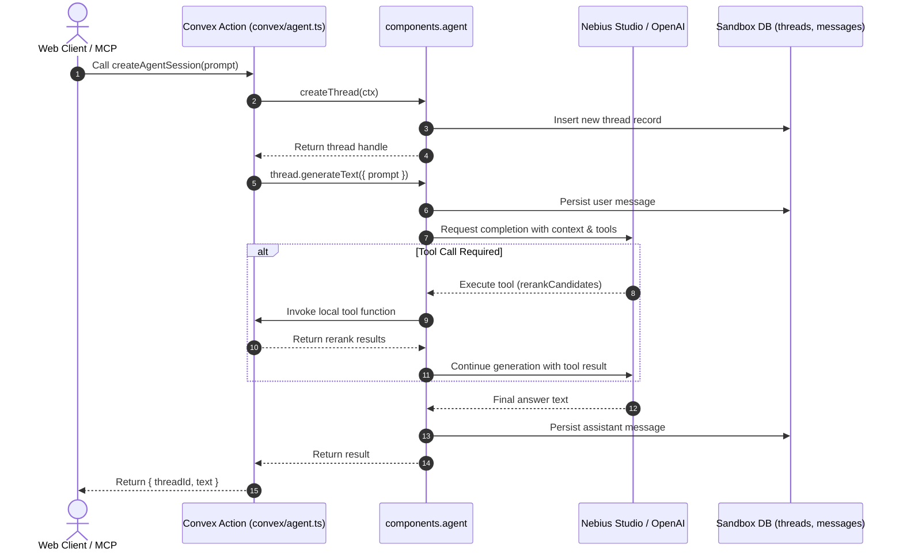

# Agent Component Architecture

Technical specification of the `@convex-dev/agent` component data flow and execution sandboxing.

---

## Sandbox Isolation

The Agent component runs within an isolated Convex component boundary. Its internal database schemas are segregated from the primary application tables:

```
Convex Deployment
│
├── App Schema (convex/schema.ts)
│   ├── workspaces
│   ├── apiKeys
│   ├── rankSessions
│   ├── candidates
│   └── receipts
│
└── Component Sandbox (@convex-dev/agent)
    ├── threads (threadId, title, metadata, state)
    └── messages (messageId, threadId, role, content, toolCalls, tokens)
```

---

## Execution Flow



---

## Sandboxed Table Specifications

### 1. `threads` Table
- `id`: Unique identifier for the conversation thread.
- `title`: Optional thread title for UI display.
- `metadata`: Arbitrary key-value store for user ID, workspace ID, or routing tags.
- `updatedAt`: Timestamp for reactive sorting and LRU eviction.

### 2. `messages` Table
- `threadId`: Foreign key reference to the parent thread.
- `role`: Message role (`system`, `user`, `assistant`, `tool`).
- `content`: Message payload (text blocks or structured JSON parts).
- `toolCalls`: Serialized function invocations and responses.
- `tokenUsage`: Accounting metrics for token burn tracking.
