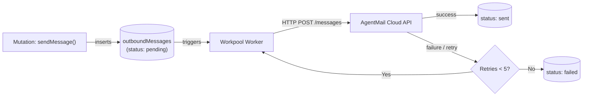

# AgentMail Durable Sending & Workpools

Outbound email delivery, transactional queues, and retry semantics.

---

## Outbound Queue Flow

To ensure emails are never lost during network partitions or downstream rate limits, sending is executed in two stages:

1. **Transactional Enqueue:** A mutation inserts an outbound record into the `outboundMessages` table with status `"pending"`.
2. **Workpool Dispatch:** A background Convex action picks up the record and calls the AgentMail REST API with exponential backoff.



---

## Code Example: Sending with Delivery Tracking

```typescript
import { mutation, query } from "./_generated/server.js";
import { components } from "./_generated/api.js";
import { AgentMail, type OutboundId } from "@agentmail/convex";
import { v } from "convex/values";

const agentmail = new AgentMail(components.agentmail);

export const sendSummaryEmail = mutation({
  args: {
    inboxId: v.string(),
    to: v.string(),
    subject: v.string(),
    text: v.string(),
  },
  handler: async (ctx, args) => {
    const outboundId = await agentmail.sendMessage(ctx as any, args.inboxId, {
      to: args.to,
      subject: args.subject,
      text: args.text,
      labels: ["rank-summary", "automated"],
    });
    return outboundId;
  },
});

export const getSendStatus = query({
  args: { outboundId: v.string() },
  handler: async (ctx, args) => {
    return await agentmail.status(ctx as any, args.outboundId as OutboundId);
  },
});
```
