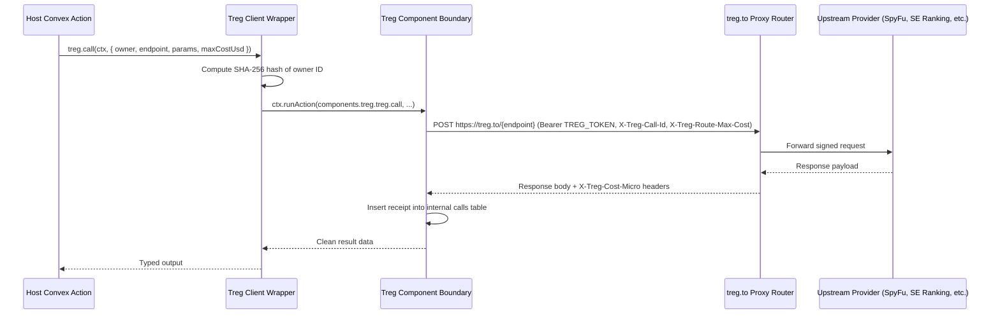

# Tool Calling & Catalog Routing

The Treg component provides dynamic access to 2,600+ external developer and intelligence tools catalogued on **treg.to**.

---

## Tool Execution Flow



---

## Catalog & Endpoint Selection

Search the full catalog via the search endpoint or CLI:

```bash
curl "https://treg.to/catalog/search?q=competitors"
```

### High-Volume Provider Rows

| Provider | Endpoint ID | Approx. Cost | Typical Use Case |
|---|---|---|---|
| **SpyFu** | `spyfu.google.domain.competitors` | $0.0002 / row | Fast keyword-overlap ranking and SEO competitor discovery |
| **SE Ranking** | `seranking.google.domain.competitors` | $0.0179 / call | In-depth domain metrics, traffic estimations, and organic rankings |
| **SerpApi** | `serpstat.google.domain.competitors` | $0.0005 / result | Multi-engine search SERP scraping |
| **Brave Search** | `brave.web.search` | $0.0008 / query | Real-time web retrieval for agent grounding |

---

## Resilient Failover Strategy

When executing mission-critical agent workflows, configure failover between equivalent provider rows:

1. **Primary Attempt:** Call the lowest-cost high-throughput provider (e.g. `spyfu.google.domain.competitors`).
2. **Failover Condition:** If upstream returns HTTP 429 (rate limit), 503 (service unavailable), or triggers a timeout, immediately failover to secondary provider (`seranking.google.domain.competitors`).
3. **No Failover on Client Errors:** If upstream returns HTTP 400 (bad request) or 422 (validation error), abort without retry to avoid wasting reserve budget on malformed parameters.
