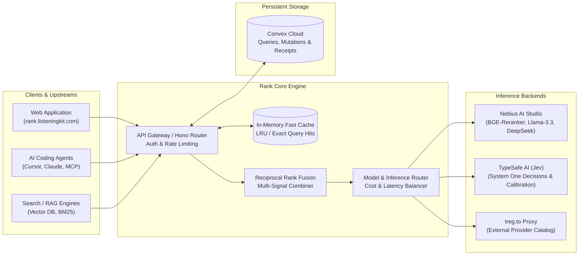
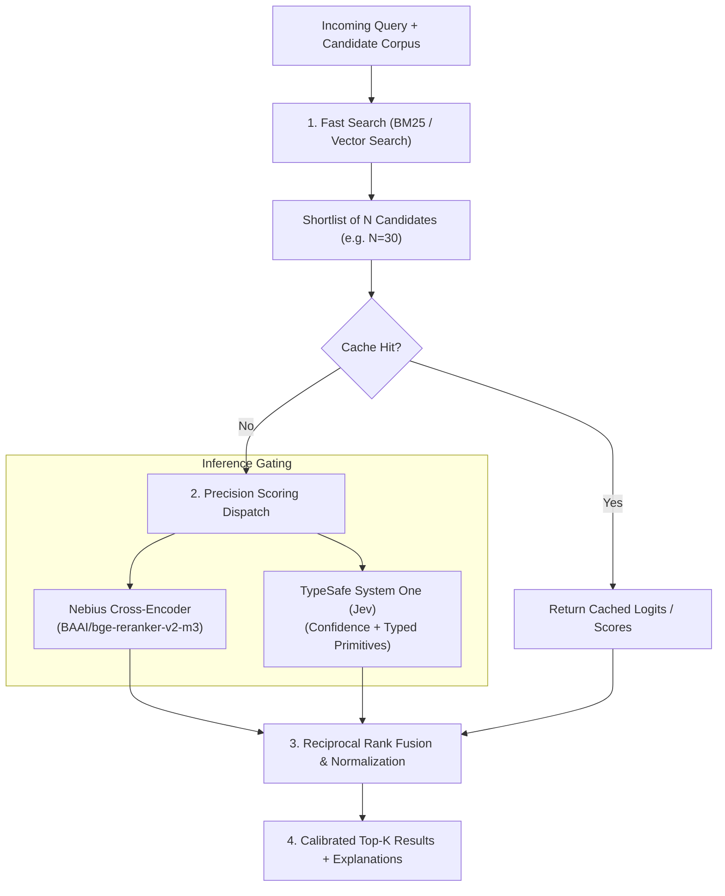
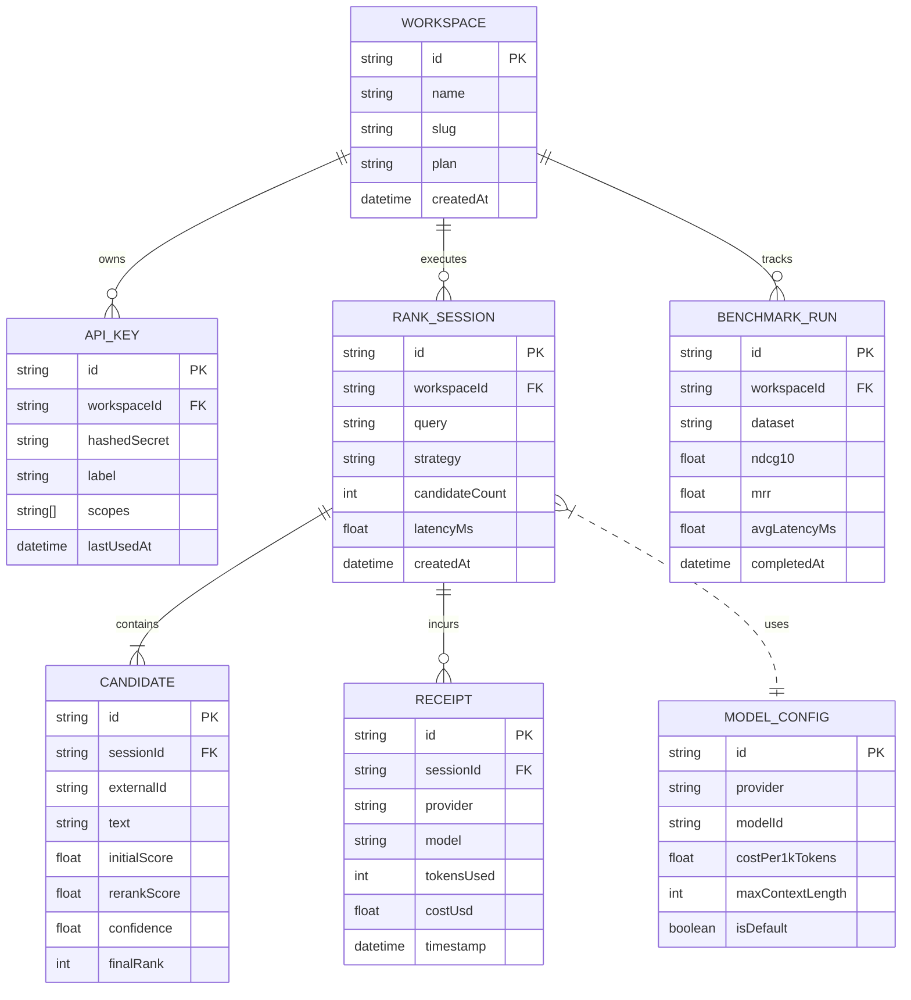
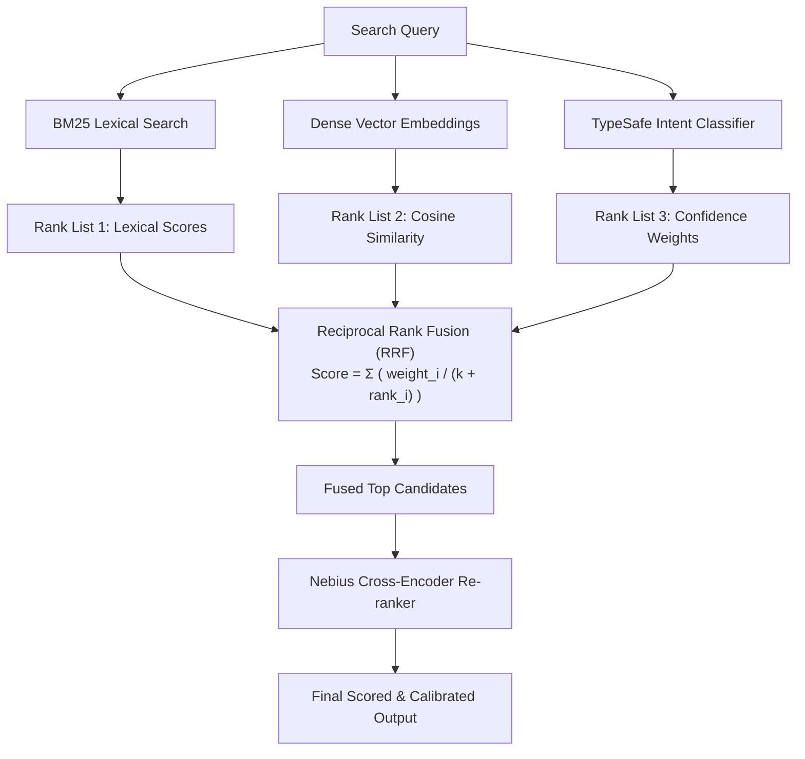

# Architecture & Flow Diagrams

This directory contains domain-separated Mermaid diagrams documenting the **Rank by ListeningKit** architecture, retrieval and reranking pipelines, data model, and security flows. Each diagram is maintained as a standalone `.mmd` file for modularity and rendered below with documentation.

---

## 📊 Table of Diagrams

| Domain | Diagram | Source File | Description |
|---|---|---|---|
| **System** | [System Overview](#1-system-overview) | [`system-overview.mmd`](system-overview.mmd) | High-level topology across web clients, AI agents, caching, Nebius Studio, TypeSafe, and Convex |
| **Pipeline** | [Two-Stage Ranking Pipeline](#2-two-stage-ranking-pipeline) | [`ranking-pipeline.mmd`](ranking-pipeline.mmd) | Fast candidate retrieval into precision cross-encoder re-ranking with in-memory caching |
| **Data Model** | [Entity Relationship Diagram](#3-data-model-erd) | [`data-model-erd.mmd`](data-model-erd.mmd) | Schema entities for Workspaces, API Keys, Rank Sessions, Candidates, Receipts, and Models |
| **Security** | [API Key Auth & Execution Flow](#4-api-key-auth--execution-flow) | [`api-auth-sequence.mmd`](api-auth-sequence.mmd) | Client request validation, SHA-256 key check, cache lookup, Nebius relay, and async billing ledger |
| **Scoring** | [Reciprocal Rank Fusion Flow](#5-reciprocal-rank-fusion-flow) | [`rrf-fusion-flow.mmd`](rrf-fusion-flow.mmd) | Multi-signal rank aggregation combining BM25, dense embeddings, and cross-encoders |

---

### 1. System Overview

**File:** [`system-overview.mmd`](system-overview.mmd)



---

### 2. Two-Stage Ranking Pipeline

**File:** [`ranking-pipeline.mmd`](ranking-pipeline.mmd)



---

### 3. Data Model ERD

**File:** [`data-model-erd.mmd`](data-model-erd.mmd)



---

### 4. API Key Auth & Execution Flow

**File:** [`api-auth-sequence.mmd`](api-auth-sequence.mmd)

```mermaid
sequenceDiagram
  autonumber
  actor Client as Client / Agent
  participant Gateway as API Gateway (Hono)
  participant Auth as Auth & Rate Limiter
  participant Cache as Fast LRU Cache
  participant Nebius as Nebius AI Studio
  participant Storage as Convex Ledger

  Client->>Gateway: POST /v1/rerank (Bearer sk-rank-...)
  Gateway->>Auth: Validate API Key & Scopes
  Auth-->>Gateway: Key Valid (Workspace: ws_123)
  
  Gateway->>Cache: Lookup hash(query + candidates)
  alt Cache Hit
    Cache-->>Gateway: Return Scored Results (sub-ms)
  else Cache Miss
    Gateway->>Nebius: POST /v1/rerank (Cross-Encoder Batch)
    Nebius-->>Gateway: Raw Logits & Softmax Probs
    Gateway->>Cache: Store Scored Results
    Gateway->)Storage: Record Receipt & Token Telemetry (Async)
  end

  Gateway-->>Client: 200 OK (Ranked Candidates + Metadata)
```

---

### 5. Reciprocal Rank Fusion Flow

**File:** [`rrf-fusion-flow.mmd`](rrf-fusion-flow.mmd)


