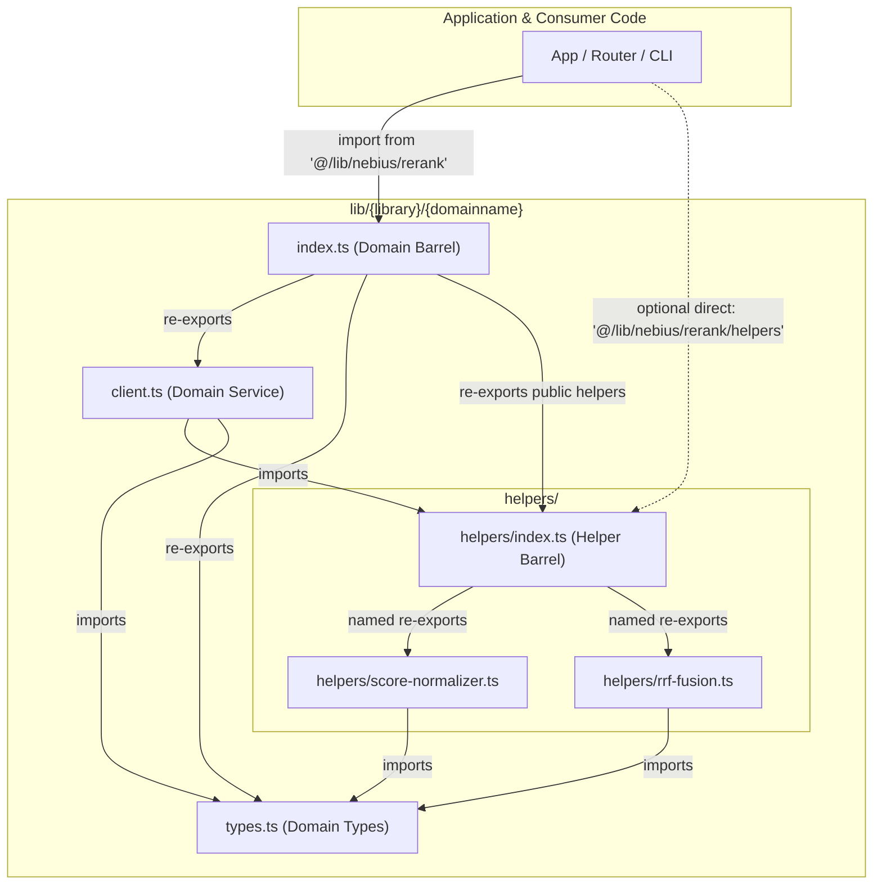

# Architecture & Naming Conventions: `lib/{library}/{domainname}`

This document defines the architectural standard, directory hierarchy, and naming conventions for all internal modules, wrappers, and integration libraries across **Rank by ListeningKit**.

---

## 1. Architectural Philosophy & Overview

As demonstrated in Domain-Driven Design (DDD) specifications such as [Clean Domain Architecture](https://github.com/rafael-vaz/clean-domain-architecture) and [TypeScript DDD Architecture](https://github.com/zhuravlevma/typescript-ddd-architecture), complex software systems thrive when codebase structures reflect clear bounded contexts and unidirectional dependency graphs.

In Rank, we enforce a strict two-tier namespacing architecture:

```
lib/{library}/{domainname}/
```

Where:
1. **`{library}`**: The integration target, technology platform, or foundational layer (e.g., `nebius`, `typesafe`, `convex`, `hono`, `treg`, `agentmail`, `fumadocs`, `core`).
2. **`{domainname}`**: The normalized bounded-context capability domain (e.g., `rerank`, `inference`, `evaluator`, `telemetry`, `registry`, `dispatcher`, `routing`).
3. **`helpers/`**: The nested sub-package containing isolated, pure helper routines with a dedicated re-export barrel.

This layout eliminates arbitrary file placement, prevents cross-domain coupling, enables modular tree-shaking, and makes module navigation intuitive for both developers and agentic tooling.

---

## 2. Directory Hierarchy Specification

Every package in `lib/` must adhere to the following directory layout:

```text
lib/
└── {library}/
    └── {domainname}/
        ├── helpers/
        │   ├── <helper-name>.ts         # Pure, unit-testable helper functions
        │   └── index.ts                 # Dedicated helpers barrel export
        ├── types.ts                     # Domain interfaces, types, and schemas
        ├── client.ts (or core service)  # Primary domain service/client class
        └── index.ts                     # Public entry point re-exporting domain & helpers
```

### Real-World Example: Nebius Cross-Encoder Reranking

```text
lib/nebius/rerank/
├── helpers/
│   ├── score-normalizer.ts     # Min-max scaling and logit normalization
│   ├── rrf-fusion.ts           # Reciprocal rank fusion calculation
│   └── index.ts                # Re-exports score-normalizer and rrf-fusion
├── types.ts                    # RerankRequest, RerankResponse, RrfOptions
├── client.ts                   # NebiusRerankClient class
└── index.ts                    # Public domain barrel (client, types, and public helpers)
```

---

## 3. Domain Name Normalization Rules

To maintain determinism across platforms (Linux, macOS, and Windows case-insensitive filesystems), `{library}` and `{domainname}` must be normalized according to the following strict criteria:

| Rule | Requirement | Good Example | Bad Example (Prohibited) |
| :--- | :--- | :--- | :--- |
| **Casing** | Strictly lowercase | `rerank`, `evaluator` | `ReRank`, `Evaluator`, `EVAL` |
| **Separators** | Hyphen (`-`) for compound words (kebab-case) | `rate-limit`, `health-check` | `rateLimit`, `rate_limit`, `RateLimit` |
| **Grammar** | Singular noun or verb-noun capability | `telemetry`, `cache` | `telemetries`, `caching_utils` |
| **Characters** | Alphanumeric and hyphens only (`^[a-z0-9-]+$`) | `bge-m3`, `v1-alpha` | `rerank@v1`, `rerank_core` |
| **Depth** | Exactly 2 levels under `lib/` | `lib/nebius/rerank/` | `lib/nebius/ai/rerank/` (flattened domains) |

---

## 4. The `helpers/` Architecture & Clean Re-Importing

A common failure mode in modular TypeScript projects is circular dependencies between primary service files and helper utilities. As noted by [Marc Nuri on Barrel Exports](https://blog.marcnuri.com/barrel-exports-javascript-typescript) and [Danny Engineering on Barrel Files](https://www.danny.engineering/article/what-are-barrel-files-why-they-matter-and-when-not-to-use-them), wildcard re-exports (`export *`) and improper circular references crash runtime bundlers and degrade tree-shaking performance.

To achieve clean re-importing and prevent circular dependencies, Rank mandates the **Unidirectional Helper Graph**:



### 4.1 Internal Helper Implementation (`helpers/score-normalizer.ts`)

Helpers must be pure functions with zero external side effects:

```typescript
// lib/nebius/rerank/helpers/score-normalizer.ts

/**
 * Normalizes an array of raw logit scores into [0, 1] range using min-max scaling.
 */
export function normalizeScores(scores: number[]): number[] {
  if (scores.length === 0) return [];
  const min = Math.min(...scores);
  const max = Math.max(...scores);
  if (max === min) return scores.map(() => 1.0);
  return scores.map((s) => (s - min) / (max - min));
}
```

### 4.2 Helper Re-Export Barrel (`helpers/index.ts`)

The helper barrel groups and re-exports all helper functions using **explicit named exports**, as recommended by [CoddyKit's Re-exports and Barrel Files Guide](https://www.coddykit.com/courses/typescript/re-exports-and-barrel-files-3365317):

```typescript
// lib/nebius/rerank/helpers/index.ts

export { normalizeScores } from './score-normalizer.js';
export { calculateRrfScore, mergeRankings } from './rrf-fusion.js';
```

> [!IMPORTANT]
> **Rule of Zero Inward Imports:** Files inside `helpers/` must **NEVER** import from the parent domain barrel `../index.ts` or sibling domain barrels. Doing so creates an immediate circular dependency cycle. Helpers may only import from `../types.js` or sibling helpers within the same `helpers/` directory.

### 4.3 Domain Root Entrypoint (`lib/{library}/{domainname}/index.ts`)

The domain root acts as the unified public facade for consumers. It exposes:
1. Domain types via `export type`
2. The core client or service
3. Selected public helper functions forwarded from `helpers/index.js`

```typescript
// lib/nebius/rerank/index.ts

export type {
  NebiusRerankConfig,
  RerankCandidate,
  RerankResult,
  RrfOptions,
} from './types.js';

export { NebiusRerankClient } from './client.js';

// Clean helper re-exports
export {
  normalizeScores,
  calculateRrfScore,
  mergeRankings,
} from './helpers/index.js';
```

### 4.4 Consumer Import Ergonomics

Consumers can now import everything cleanly from the domain path alias, without deep, brittle relative directory traversal:

```typescript
// Clean public domain import:
import {
  NebiusRerankClient,
  calculateRrfScore,
  type RerankCandidate,
} from '@/lib/nebius/rerank';

// Direct helper import (ideal for lightweight worker threads or test suites):
import { calculateRrfScore } from '@/lib/nebius/rerank/helpers';
```

As demonstrated in [GitHub Gist: Organizing a TypeScript Project](https://gist.github.com/coltenkrauter/870b2654520a5366b072e4c460686efa) and [Web Dev Tutor's Barrel Files Guide](https://www.webdevtutor.net/blog/typescript-barrel-file), centralized barrels reduce import clutter while keeping the internal directory structure decoupled from consumers.

---

## 5. File & Symbol Naming Standards

In accordance with [rich-domain](https://github.com/4lessandrodev/rich-domain) and standard TypeScript engineering best practices:

| Construct | Convention | Format | Example |
| :--- | :--- | :--- | :--- |
| **Directory Name** | kebab-case | `[a-z0-9-]+` | `lib/nebius/rerank/helpers/` |
| **File Name** | kebab-case | `[a-z0-9-]+\.ts` | `score-normalizer.ts`, `rate-limiter.ts` |
| **Class Name** | PascalCase | `^[A-Z][a-zA-Z0-9]+$` | `NebiusRerankClient`, `ConfidenceEvaluator` |
| **Interface / Type** | PascalCase | `^[A-Z][a-zA-Z0-9]+$` | `RankCandidate`, `EvaluationMetric` |
| **Function Name** | camelCase | `^[a-z][a-zA-Z0-9]+$` | `calculateRrfScore()`, `formatDuration()` |
| **Constants** | UPPER_SNAKE_CASE | `^[A-Z0-9_]+$` | `DEFAULT_RRF_K`, `MAX_CANDIDATE_LIMIT` |

---

## 6. Domain Taxonomy Matrix for Rank

The following table documents the approved `{library}` and `{domainname}` namespaces for Rank:

| Library (`{library}`) | Domain (`{domainname}`) | Responsibility | Primary Exports |
| :--- | :--- | :--- | :--- |
| `nebius` | `rerank` | Cross-encoder semantic reranking (`bge-reranker-v2-m3`) | `NebiusRerankClient`, `calculateRrfScore`, `normalizeScores` |
| `nebius` | `inference` | High-throughput open-weights LLM generation on Nebius GPUs | `NebiusInferenceClient`, `formatChatPrompt` |
| `typesafe` | `evaluator` | Calibrated decision evaluation (Choice, Score, Noul via Jev) | `TypeSafeEvaluator`, `calculateConfidenceInterval` |
| `convex` | `telemetry` | Audit logs, latency metrics, and mutation persistence | `ConvexTelemetryLogger`, `formatLatencyMetric` |
| `hono` | `router` | Ultra-low latency HTTP API handlers and OpenAPI schemas | `createApiRouter`, `validateRequestPayload` |
| `treg` | `registry` | Schema verification and dynamic payload validation | `TregSchemaRegistry`, `verifyCandidateSchema` |
| `agentmail` | `dispatcher` | Email notification triggers and agent communication hooks | `AgentMailDispatcher`, `composeAlertMessage` |
| `fumadocs` | `docs-engine` | Interactive API reference generator and doc search | `initFumadocsSearch`, `renderOpenApiSpec` |
| `core` | `cache` | Hot-path LRU and in-memory candidate cache | `RankCache`, `hashQueryString` |

---

## 7. Anti-Patterns & Prohibitions

To ensure repository consistency, the following patterns are strictly prohibited and flagged by our gating hooks:

1. [PROHIBITED] **Mixed-Case or CamelCase Directories:**
   - Prohibited: `lib/Nebius/ReRank/`, `lib/typesafe/decisionEvaluator/`
   - Allowed: `lib/nebius/rerank/`, `lib/typesafe/evaluator/`
2. [PROHIBITED] **Omitting the `helpers/` Barrel:**
   - Prohibited: Creating helper files under `helpers/` without an `index.ts` re-export.
   - Allowed: Always provide `helpers/index.ts` with explicit named re-exports.
3. [PROHIBITED] **Circular Imports to Parent Index:**
   - Prohibited: `import { NebiusRerankClient } from '../index.js'` from inside `helpers/`.
   - Allowed: Helpers only import from `../types.js` or peer helpers `./*.js`.
4. [PROHIBITED] **Wildcard Mega-Barrels:**
   - Prohibited: `export * from './helpers/score-normalizer'` in parent barrels without named intent.
   - Allowed: Explicit named exports: `export { normalizeScores } from './helpers/index.js'`.
5. [PROHIBITED] **Deep Relative Traversal from Application Code:**
   - Prohibited: `import { normalizeScores } from '../../../../lib/nebius/rerank/helpers/score-normalizer.js'`
   - Allowed: `import { normalizeScores } from '@/lib/nebius/rerank'` or `@/lib/nebius/rerank/helpers`.

---

## 8. Automated Enforcement

Naming conventions are automatically validated before every commit and push via **Lefthook** and `scripts/check-naming-conventions.mjs`.

To run the convention checker manually:

```bash
node scripts/check-naming-conventions.mjs
```

The script ensures:
- All paths conform to `lib/{library}/{domainname}/` (where `{library}` and `{domainname}` match `^[a-z0-9-]+$`).
- Every domain directory contains an `index.ts` file.
- If a `helpers/` directory exists, it contains an `index.ts` barrel.
- No files inside `helpers/` import from the parent `../index.ts`.

---

## Sources

- [What Are Barrel Files? Why They Matter And When Not To Use Them.](https://www.danny.engineering/article/what-are-barrel-files-why-they-matter-and-when-not-to-use-them)
- [What are Barrel Exports in JavaScript and TypeScript? - Marc Nuri](https://blog.marcnuri.com/barrel-exports-javascript-typescript) (Feb 2026 update)
- [Mastering Typescript Barrel Files: Organize Your Code Like a Pro](https://www.webdevtutor.net/blog/typescript-barrel-file) (Sep 2024)
- [Organizing a TypeScript Project · GitHub Gist](https://gist.github.com/coltenkrauter/870b2654520a5366b072e4c460686efa)
- [Clean Domain Architecture - Modular Bounded Contexts with TypeScript](https://github.com/rafael-vaz/clean-domain-architecture) (May 2026)
- [TypeScript DDD Architecture for Nest.js](https://github.com/zhuravlevma/typescript-ddd-architecture)
- [rich-domain: Domain-Driven Design in TypeScript](https://github.com/4lessandrodev/rich-domain)
- [typeddd: TypeScript Domain Driven Design](https://github.com/beincom/typeddd)
- [Re-exports and Barrel Files — TypeScript Academy | CoddyKit](https://www.coddykit.com/courses/typescript/re-exports-and-barrel-files-3365317)

*Search query payloads saved to `/tmp/domain-naming-conventions.json` and `/tmp/domain-architecture-patterns.json`.*
